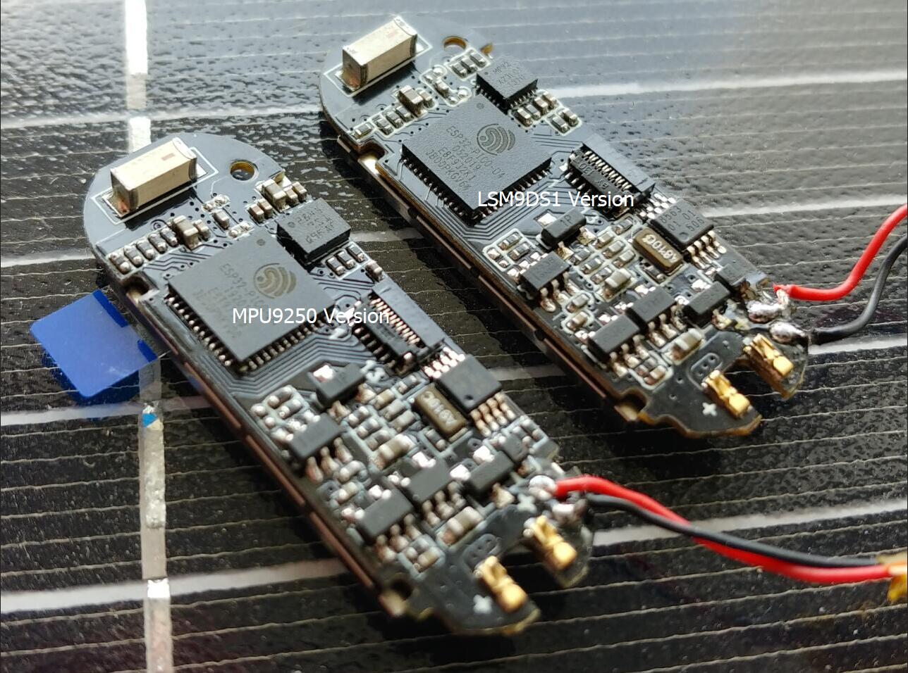

<h1 align = "center">🌟LilyGo T-Wristband🌟</h1>

- LSM9DS1 is an alternative sensor for MPU9250. How to distinguish the version you purchased, please see the upper right part of the board below to distinguish

- LSM9DS1 为MPU9250的替代传感器，如何分辨你购买的版本，请看下图板子的右上半部分，进行区分
  

<h2 align = "left">📷 Product:</h2>

|                                      Examples                                       |         Product  Link          |                           Schematic                           | Status |
| :---------------------------------------------------------------------------------: | :----------------------------: | :-----------------------------------------------------------: | :----: |
| [Click to view LSM9DS1 Version(点击查看)](./examples/T-Wristband-LSM9DS1/README.MD) | [Click to view product link]() | [Click to view](./schematic/T_Wristband_lsm9ds1_20200306.pdf) |   ✅    |
| [Click to view MPU9250 Version(点击查看)](./examples/T-Wristband-MPU9250/README.MD) |            Obsolete            |     [Click to view](./schematic/T_Wristband_mpu9250.pdf)      |   ❌    |
|   [Click to view MAX3010X (点击查看)](./examples/T-Wristband-MAX3010X/README.MD)    | [Click to view product link]() |     [Click to view](./schematic/T_Wristband_MAX30102.pdf)     |   ✅    |

