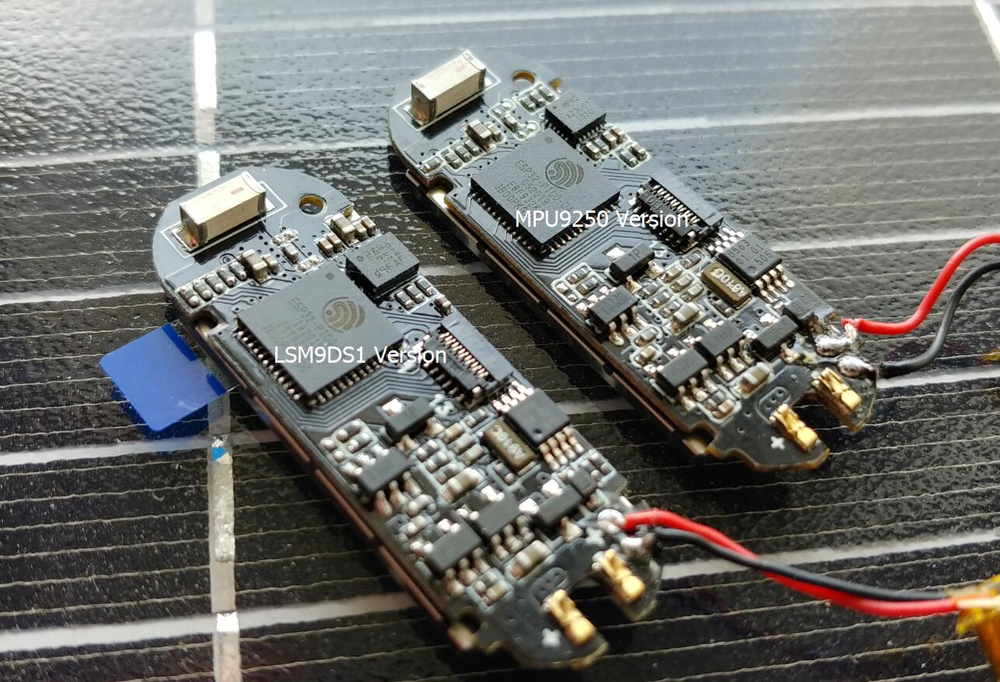

********
故障排查
********

硬件
=====

.. _tft_issue:

新版本屏幕（有绿色标签）需要改变配置
-------------------------------------

因为供货的问题，新版本的屏幕与旧版本的屏幕的配置有所不同。目前（2022-09-05）出货均为新版本屏幕。

.. image:: ../_static/readme/new_version_green_tag.png

对于不同版本的屏幕，需要更改 ``C:\<UserName>\Documents\Arduino\libraries\TFT_eSPI\User_Setups\Setup26_TTGO_T_Wristband.h`` 中的宏定义：

* 新版本屏幕（有绿色标签）

.. image:: ../_static/readme/new_version.png

* 旧版本屏幕

.. image:: ../_static/readme/older_version.png

如何区分 LSM9DS1 与MPU9250 传感器？
-----------------------------------

请看下图板子的右上半部分，进行区分:

