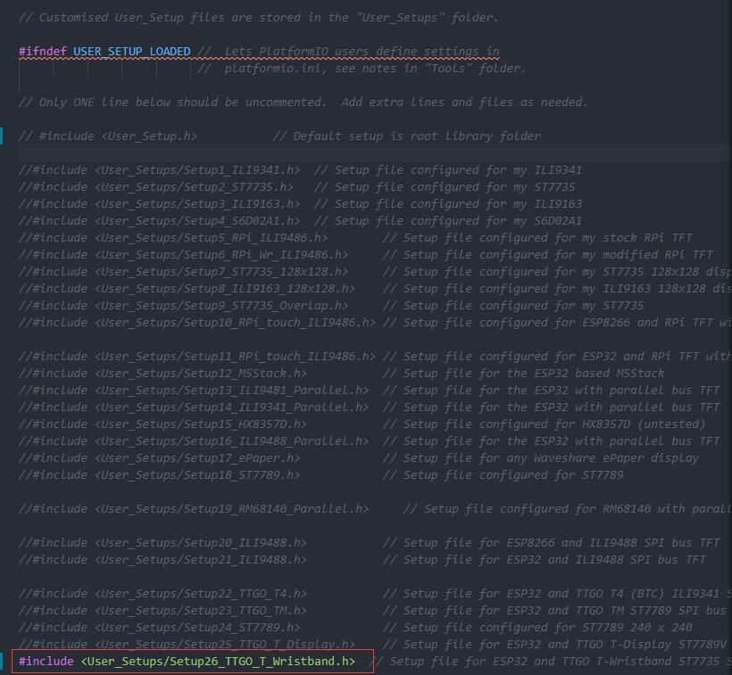
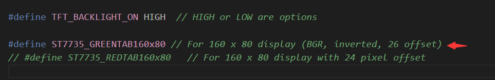

## **English | [中文](../../docs/mpu9250_cn.md)**

## Before use, please read the description below

1. Install the corresponding driver according to the serial communication board you use
   - [CP21xx Drivers](https://www.silabs.com/products/development-tools/software/usb-to-uart-bridge-vcp-drivers)
   - [CH340 Drivers](http://www.wch-ic.com/search?q=ch340&t=downloads)

2. Install the dependent libraries in the following list, the required library files have been placed in the `libdeps` by default, please copy all the files in the`libdeps` directory to `C:\<UserName>\Documents\Arduino\libraries` In the catalog
   - [TFT_eSPI](https://github.com/Bodmer/TFT_eSPI)
   - [PCF8563_Library](https://github.com/lewisxhe/PCF8563_Library)

3. Configure the TFT header file (**If you use the library file in the `libdeps` directory, you can skip this step**)
   - Find the **TFT_eSPI** directory in your library folder directory
   - Find `User_Setup_Select.h` in the root directory of **TFT_eSPI** and open it for editing
   - Comment out the file header `#include <User_Setup.h>`
   - Find `#includen <User_Setups/Setup26_TTGO_T_Wristband.h>`, cancel the previous comment, save and exit
   - The final effect is as follows:
        

   - For the new version you need to change the macro definition in `Setup26_TTGO_T_Wristband.h`

       **new version(green label) :** `#define ST7735_REDTAB160x80`
      

       **older version :** `#define ST7735_GREENTAB160x80`
      

4. The board choose **ESP32 Dev Module**, other settings can be kept as default, note that `T-Wristband` does not use PSRAM, please do not turn on PSRAM, and call PSRAM function

5. The `ARDUINO_OTA_UPDATE` macro is used for **WiFiManager** and **OTA update**, the default is off, if you need to open, please open in `sketch`
   - When `ARDUINO_OTA_UPDATE` is turned on, touch and hold the button for three seconds to reset `WiFi`
   - After enabling OTA update, you can select `T-Wristband` in the Arduino IDE port for over-the-air upgrade, as shown below
        

6. The `FACTORY_HW_TEST` macro is used to test whether the hardware status of the bracelet is normal, and it is closed by default. If you need to open it, please open it in ` sketch`
   
7. Touch the button to switch to the next function when a press is detected
   - Press for the first time to view the nine-axis sensor information
   - Press it a second time to enter deep sleep
   - During deep sleep, touch again to wake up the bracelet
  
## Datasheet
- [MPU9250 Sensor](https://invensense.tdk.com/wp-content/uploads/2015/02/PS-MPU-9250A-01-v1.1.pdf)
- [ST7735](http://www.displayfuture.com/Display/datasheet/controller/ST7735.pdf)
- [ESP32-PICO-D4](https://www.espressif.com/sites/default/files/documentation/esp32-pico-d4_datasheet_en.pdf)
- [DRV2605](https://www.ti.com/product/DRV2605)

## Pin definition

| Name              | Pin    |
| ----------------- | ------ |
| TFT Driver        | ST7735 |
| TFT_MISO          | N/A    |
| TFT_MOSI          | 19     |
| TFT_SCLK          | 18     |
| TFT_CS            | 5      |
| TFT_DC            | 23     |
| TFT_RST           | 26     |
| TFT_BL            | 27     |
| Touchpad          | 33     |
| Touchpad Power    | 25     |
| IMU Interrupt     | 38     |
| RTC Interrupt     | 34     |
| Battery ADC       | 35     |
| VBUS ADC          | 36     |
| I2C SDA           | 21     |
| I2C SCL           | 22     |
| LED and Vibration | 4      |
| CHARGE Indication | 38     |

